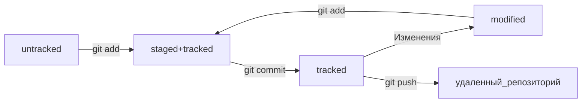

# Консольные команды  
#### Навигация  
- pwd - покажи, в какой я папке  
- ls - покажи файлы и папки в текущей папке  
- ls -a - + скрытые файлы/папки  
- cd **{название папки}** - перейди в папку  
- cd ~ - перейди в домашнюю директорию  
- cd / - перейди в корневую директорию  
#### Работа с файлами и папками  
##### Создание  
- touch **{название и расширение файла}** - создай файл  
- mkdir **{название папки}** - создать директорию  
##### Копирование и перемещение  
- cp **{название файла}** **{путь до директории}** - скопировать файл в указанную директорию  
- mv **{название файла}** **{путь до директории}** - переместить файл в указанную директорию  
##### Чтение  
- cat **{название файла}** - распечатать содержимое файла  
##### Удаление  
- rm **{название файла}** - удалить файл  
- rmdir **{название папки}** - удалить папку  
- rm -r **{название папки}** - удаить папку со всем содержимым   
# Шпаргалка по работе с гит  (то что я пока освоил)
#### Создание репозитория  
- $ git init **{имя}** - создание локального репозитория  
- $ git clone **{url}** - скачать репозиторий  
#### Состояние репозитория  
- $ git status - список незакомиченных фалов  
- $ git log - список коммитов 
- $ git log --oneline - сокращенный лог   
- $ git diff - изменение в еще не добавленных в индекс файлах  
#### Сохранение изменений  
- $ git add **{имя файла}**
- $ git add --all
- $ git commit -m "**{Сообщение}**" - закомитить добавленые в индекс файлы  
- $ git commit --amend --no-edit - добавить изменения к последнему коммиту  
- $ git commit --amend -m "**{Новое сообщение}**" - изменить сообщение в последнем коммите  
#### Синхронизация  
- $ git push - Отправить локальные коммиты в удаленный репозиторий  
- $ git remote add origin **{url}** - связать локальный репозиторий с удаленным  
- $ git remote -v - проверка наличия связи локального и удаленного  
#### Откат файлов и коммитов  
- $ git restore --staged **{файл}** - перевести файл из staged в untracked/modified  
- $ git restore **{файл}** - вернуть файл к последней версии  
- $ git reset --hard **{хеш}** - откат до указанного коммита  
#### Просмотр изменений  
- $ git diff - изменения в modified файлах  
- $ git diff **{хеш A}** **{хеш B}** - разница между A и B коммитами  
- $ git diff --staged - изменения в staged файлах
#### Прочее  
- $ git **{имя команды}** --help - подсказки  

Жизненый цикл файла в Git

